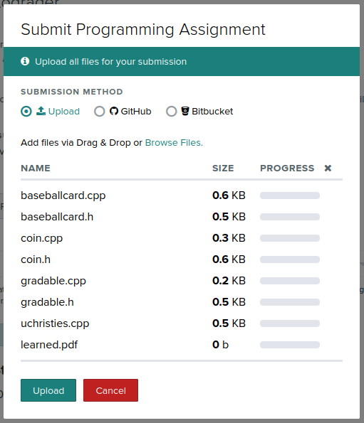
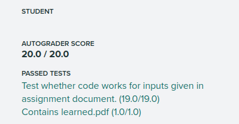

Note: Begin development of this project with the skeleton code at [./uchristies-skel.tar.gz](./uchristies-skel.tar.gz)


### UC-hristies, the UC Auction House 

Sometimes donors to the University leave rare and valuable assets to the school in their estates. It is school policy that those types of donations be immediately converted to cash, no matter whether or not the asset will likely appreciate in value (I mean, we all know that sometimes what is valuable today will not be valuable tomorrow.). In order to facilitate that liquidation, the school has asked us to write an auction application that will be able to sell anything that is so-called gradable.

There are a *ton* of services out there that will "grade" the condition of physical collectible items. For instance, there is Professional Sports Authenticator (PSA) for sports trading cards and memorabilia. There is Certified Guaranty Company (CGC) that will grade and authentic pop-culture memorabilia. Finally, there are traditional fine-art graders like Heritage Auctions (HA). Once an item that the University receives as a donation is graded, the school can deliver the item to an appraiser who will value the item. With a value in mind and a well-respected company backing an assessment of the item's physical condition, we can take the item to auction and be sure that the donor's item is converted to cash in a way that maximizes its impact for the University.

The Trustees have asked us to write an application that will manipulate accounting information about items that people donate. It will track the donations' important attributes (Walls and Mirrors, Pg. 3) and allow users to define behaviors (Walls and Mirrors, Pg. 3) to customize the operations of the valuation and grading of the donations. In this mini assignment, we will learn how C++ makes it possible to write easily and quickly an application with this functionality. In particular, we will use features in the language like virtual functions, abstract classes, inheritance and polymorphism.

In this mini assignment we will rely on your knowledge of how to write classes, how to write derived classes, how to define data members and member functions, how to instantiate objects, etc. Any new features of C++ that we introduce in this assignment are discussed in Walls and Mirrors Chapter 1 and Prelude 1.

### Users, Implementers and Derivers, Oh My.

We are going to be talking about several different people during this mini assignment and we are going to refer to them according to their personas, the role that the play. There will be the ultimate "end users" of the application. These are the people that will load the application on their Windows-, macOS- or Linux-based operating system and help the University make money. We will infrequently talk about end users and, when we do, we will try to refer to them by that entire name.

Then there is the "library developer" persona. This is the developer who is responsible for a) designing and b) eventually implementing the various abstract data types required to successfully build the UChristies application. In most cases in this mini assignment, "we" will be playing the library developer persona.

Finally, there is the "developer user" who we will mostly refer to simply as the user. This *programmer* is the user of the abstract data types that "we" (as library developer) are going to be developing. They are the developer who implements the so-called [business and application logic](https://en.wikipedia.org/wiki/Business_logic), user interface, and data management, etc of the UChristies program that the end user will ultimately see. 

To be extra clear, when "we" are in the library developer persona, our user is the person who will ultimately use the code that we write to implement abstract data types to build  a computer program that an end-user executes. In other words, the end user of the code written by the library developer is another programmer.

## The Gradable Item

First things first! We are going to need a representation of a gradable item -- the *thing* that the donor bequeathed (we will see why we call it gradable in just a second). As the authors of Walls and Mirrors make explicit (Pgs. 12-13), there is a difference between an abstract data type (an ADT) and a data structure. The former is an *abstraction* of the latter. The former gives us the freedom to think about a design without worrying about the details of its implementation. Once we define an ADT, we can turn our attention to its implementation (using a data structure) -- the time when we get to write the code.

For the Gradable Item ADT, what are the attributes that we need to track about it? It is in the answer to this question that we are confronted with our first design problem -- just *imagine* all the *different* valuable items that people could donate: coins, stamps, arts, prints, clothes, jewelry, antiques ... The list goes on and on. Because the possibilities are endless, I think that our goal should be to include only the barest of essentials. Then, *later*, we can use other features of C++ to handle all those other crazy cases to account for when, say, a donor wills the University their 19th century mustache wax once used by President Taft (yes, I just made that up).

I suggest that we go with tracking the following attributes for a donated gradable item:

1. The name of the person who donated the item;
2. The year that they donated it;
3. The rating given to that item; and
4. The price of that item.

Great.

And now let's do the same for operations. What are the barest minimum set of operations that we would want to support? Well, we know that the University will want to have this item graded (to determine its rating [see above]) and valued (to determine its price [again, see above]) (I hope that you now see why we are calling it a *gradable* item). So, let's have the following operations:

1. Grade
2. Value

We have the interface that we want to support for what we will refer to as the Gradable Item ADT. 

## Refining The Item

We can start to work from this definition of the Gradable Item ADT toward an actual implementation one step at a time. The first step is to assign *types* to the attributes:

1. Let's track the name of the person who donated the item as a `string`;
2. Let's track the year that they donated it as a `positive whole number`;
3. Let's track the rating given to that item as a `floating-point number between 0 and 100`;
4. Let's track the price of that item as a `positive floating-point number`.

Great! 

And now what about the inputs and outputs of our Gradable Item ADT's behaviors? Well, honestly, neither of the operations need any input from the user (they have all that they need internally within the ADT) nor do they provide any output to the user (the user can get the results of those operations by retrieving the rating and the price, respectively). So, we can just say that they take no parameters and return an `empty` value. 

Here's a chart that we could give our users (N.B.: you will see charts that look like this throughout the semester) that completely explains the ADT:

|Attribute/Operation|Name|Description|Type|Parameters|
|--|--|--|--|--|
|Attribute| Name of the donor| The name of the person who donated the item (groundbreaking, I know) | `string` | N/A |
|Attribute| Year of donation | The year the donor bequeathed the item | `positive whole number` | N/A |
|Attribute| Donation rating | The rating of the donation according to an accredited grading agency.| `floating-point number between 0 and 100` | N/A |
|Attribute| Donation price | The price of the donation according to a knowledgeable appraiser.| `positive floating-point number` | N/A |
| Operation | Grade | Determine the item's rating | `empty` | `None`|
| Operation | Value | Determine the item's price | `empty` | `None`|


With this chart, the users of our ADT could start to plan out how they will write code that *uses* an instance of this ADT. They could use the knowledge of how to query it for data (through its attributes) and how to make it perform (through its operations) and would not have to worry *at all* about how we decide to implement it! That's really neat. 

## Brass Tacks (Let's have *those* appraised)

However, it still leaves something to be desired. Why? Because, ultimately, we are really concerned with using this ADT in a real software application. That means that we are necessarily going to have make decisions about things like data types, method names, parameters and return types, etc. Given what we have above, I think it's okay to start diving into how we are going to define a data structure that implements the Gradable Item ADT (notice that very particular wording!). 

We'll repeat the chart from above but put in some C++-specific information.

|Attribute/Operation|Name|Description|Type|Parameters|
|--|--|--|--|--|
|Attribute| `DonorName` | The name of the person who donated the item | `std::string` | N/A |
|Attribute| `DonorDate` | The year the donor bequeathed the item | `int` | N/A |
|Attribute| `Rating` | The rating of the donation according to an accredited grading agency | `double` | N/A |
|Attribute| `Price` | The price of the donation according to a knowledgeable appraiser | `int` | N/A |
| Operation | `Grade()` | Determine the item's rating | `void` | `None`|
| Operation | `Value()` | Determine the item's price | `void` | `None`|

Now, let's take that chart and convert it into the definition of a C++ class. 

> Note: What is really, really interesting about the terminology of classes in C++ is that the use of the term *definition* in *class definition* does not follow the language's usual split between *declaration* and *definition*. Usually in C++ the declaration of a thing can be separated from it's definition and those two separate components have different descriptions (i.e., the declaration and the definition, obviously). In C++ you can think of the definition as the code necessary to make a certain thing usable. For example,

```C++
std::string convert_to_uppercase(const std::string &to_convert);
```

> does not include any information about how to actually *perform* the conversion of a string to uppercase. This *declaration* does provide enough information to a user of the function to call it properly. However, it does not give the compiler enough information to generate code that will actually convert the string `to_convert` into uppercase. However,

```C++
std::string convert_to_uppercase(const std::string &to_convert) {
    std::string converted{to_convert};
    std::transform(to_convert.begin(), to_convert.end(), to_convert.begin(), 
                   [](unsigned char c){ return std::toupper(c); } // correct
                  );
    return to_convert;
}
```

> does. Therefore, we would call it the *definition*. The more I think about it, the more it maybe *does* make sense for what we are about to write to be called the function definition. More on that later ...

```C++
#ifndef __GRADABLE_H
#define __GRADABLE_H

#include <string>

class Gradable {
    public:
    Gradable(std::string donor_name, int donor_year);

    void Grade();
    void Value();

    double Rating{};
    double Price{};
    int DonorDate{};
    std::string DonorName{};
};

#endif
```

Add this code to your `gradable.h` file in the `include/` directory. 

The first thing to notice: there are no implementations anywhere to be seen. There are only member function declarations and no member function definitions. If the user of our implementation of the Gradable Item ADT were to look at this code, they would have *no* idea how we implemented these member functions. However, and this point is the key, they do not need that information. What is here is plenty for them to use our implementation of the Gradable Item ADT.


### Checkpoint 1:

Here is our first checkpoint. Make sure that the project's code compiles. If you are unsure about how to compile code using VS Code in your virtualized Linux environment, take a look at Lab 0 for complete instructions. If you are having trouble getting the code to compile, make sure that you have the exact code from above in the `gradable.h` file in the `include/` directory. If all else fails, please reach out and ask for help!

With that taken care of, let's proceed to look at the code line by line.

```C++
#ifndef __GRADABLE_H
#define __GRADABLE_H

```

These two lines pair with the
```C++
#endif
```
at the end of the file. You have all seen something like this code before, but how many of you stopped to think about what it actually means? I know that I usually just skim past it without even thinking.

As you recall, lines that begin with `#` in C++ are so-called preprocessor directives. Again, as you recall, the preprocessor is just one of the tools/steps in the C++ compilation process. The C++ preprocessor looks at all lines that begin with `#` and interprets them as commands. In this case, on the first line of the two preprocessor directives, the C++ preprocessor is asking whether there is a symbol defined named `__GRADABLE_H`. That symbol has lots of `_`s and looks intimidating, but it's really not. We could have written `__BOBS_CIRCUS` just as easily. The `ifndef` is interrogating the preprocessor to ask whether that symbol has ever been defined before by any other code that the compiler has seen. Depending on the response, the preprocessor conditionally continues to process the file. If the preprocessor has *not* seen that symbol (hence the `n` before the `def` [you can read the whole thing as "if not defined"]), then the preprocessor will consider the text between the current line and then accompanying `#endif` at the bottom of the file. If that symbol *has* been defined previously, then the text between that line and the `#endif` will be skipped. Assuming that the symbol has never been seen before, the preprocessor directive on the very next line *defines* that very symbol.

So, what's the point? The code here is part of a common *idiom* (pattern) that developers use to guarantee that for every *translation unit*, the compiler will only process the code between the `#ifndef __GRADABLE_H` and the `#endif` one time. In the vernacular, these are called "include guards". Pretty cool, huh?

I am sure you can understand why that's important, right? You would *not* want to have the compiler see the same code defining the same class more than once. But, does this situation actually occur often in real life? Let's think about just how easy it might be for the C++ programmer to induce the compiler to read/process the same source code twice. 

### Sidebar: The `#ifndef`/`#endif` Play

Let's assume that you are working with an application that stores information about a class of Students. Each of the students is modeled by a class named, well, `Student` and each of the classes is modeled by a class name, awkwardly, `Klass`. They might be written like this:

`klass.h`:
```C++
#include <vector>
#include <string>
#include <student.h>
class Klass {
public:
  Klass(std::string class_title) : m_class_title{class_title}, m_class_students{} {};


private:
  std::string m_class_title{};
  std::vector<Student> m_class_students{};
};
```

`student.h`:
```C++
#include <string>
class Student {
public:
  Student(std::string student_name) : m_student_name{student_name} {};

private:
  std::string m_student_name{};
};
```

As you can see, when the compiler attempts to `include` `student.h` in file `klass.h`, it has already included (itself) `string`. But, as the compiler processes `student.h` it `include`s `string` *again*. Wow. That was really easy to mess up. Fortunately most developers follow the safety measures described by the "ifdef guard" and the compiler won't even blink and eye when it sees something like this recursive inclusion mess.


### Back to the Preprocessor And Some Real C++
And now we encounter another preprocessor directive. This directive is much, much easier to understand than the prior ones. This preprocessor directive simply makes available to us the functionality and classes from the `string` header file. In particular, by "pound including" `string`, we have access to the `std::string` type. 

And now we finally get to some real, live C++:

```C++
class Gradable {

};
```

*defines* a class named `Gradable`. A class in C++ is a way of defining a new type in the language. Here we are defining a new type `Gradable`. C++ is a *strongly typed* language which means that *every* expression has a type. Upon parsing the declaration here, our C++ program can now have expressions whose type is `Gradable`. Pretty neat!

By default, the *access control* level of members in a C++ class is `private` (How does that differ from the default access control level of members in a C++ `struct`?). That means that *no other module* (I am using the definition of module from Walls and Mirrors here) can access those members (with one exception that we *may* cover in this course) -- not even classes that inherit from `Gradable` (more on inheritance later). 

The member functions and member variables that we are declaring/defining for the `Gradable` class that support our Gradable Item ADT are designed specifically so that the developer user can access them. If we do not alter the default access control level, the developer user will be thwarted. Therefore, 

```C++
public:
```

can be used to set the access control level to *public* (giving users of our implementation of the Gradable Item ADT access to the member variables and functions. Recall from your earlier classes in C++, the presence of a a so-called *access specifier* changes the access control level of any member variables and functions between itself and the next access specifier (where next is determined by reading the program's source code from top to bottom). Because there is no other access specifier in the `Gradable` class, all the member functions and variables are `public`. 

```C++
    Gradable(std::string donor_name, int donor_year);
```

is the *declaration* of a non-default constructor. Recall from your earlier C++ classes the meaning, utility and requirements of a constructor of a class in C++. And, as you recall, any constructor with parameters is considered a non-default constructor. As a result of declaring *only* a non-default constructor, the user of our class *cannot* write code like

```C++
Gradable zhong_bronze_bell{};
```

Why not? Because that would invoke the default constructor (the one with no parameters) and such a constructor does not exist.

But, wait! I remember learning that C++ would *give* us a default constructor for *free* if we didn't write one. Did someone lie to me? No, of course not! C++ *will* give you a default constructor for free ... until the moment you declare a constructor of any kind at which point all bets are off!

```C++
void Grade();
void Value();
```

*declares* two member functions that the user of the class can invoke that will perform the operations associated with the *grade* and *value* operations of the Gradable Item ADT. 

```C++
double Rating{};
double Price{};
int DonorDate{};
std::string DonorName{};
```

all *define* member variables that hold the attributes defined by the Gradable Item ADT that we are implementing with this data structure.

Whew. That was quite a bit of work, but I think we did a very good job.

### The Crying of Lot 49

We'll be good software engineers now and *assume* that someone else has implemented the member functions declared in the `Gradable` class *header* that we saw above. As long as the assumption holds, the (developer) user can write code that moves around the digital representation of donor deposits. In particular, they could write a function named `sell_at_auction` that would take a gradable Item to be sold at auction as a parameter and returns the price at which the item went to the gavel (as a `double`). The declaration of such a function would look like

```C++
double sell_in_auction(Gradable for_sale);
```

Take a turn as the developer user instead of library developer and add that declaration to your `uchristies.cpp` file. Notice that you are accepting the parameter by "const reference". If you do not remember what that means from your earlier days using C++, please be sure to ask.

The declaration, however, does not define how to sell that item. Let's do our best Mecum impression and decree that all the items up for auction will sell at 89% of their price. To implement that in code, the developer user could write 

```C++
const double AUCTION_OVERHEAD_FEE{0.89};

double sell_in_auction(Gradable for_sale) {
  return for_sale.Price * AUCTION_OVERHEAD_FEE; 
}
```

How cool is that? The developer user is able to implement the behavior so smoothly because of the nice names we gave our (member) variables. What's more, the developer user wrote nice code that is extensible if UC ever finds a better auction house who will take a smaller operational fee (because the value of the `const double` variable named `AUCTION_OVERHEAD_FEE` can be changed).

The developer user will call this function in their `main` function to determine the price that UC could get for its endowment if it sold off the Shot Sage Blue Marilyn print by Andy Warhol that was just donated. 

```C++
int main() {
  Gradable shot_sage_blue_marilyn{"Daddy Warbucks", 2023};

  double price_for_print{sell_in_auction(shot_sage_blue_marilyn)};

  std::cout << "The University's endowment now has $" << price_for_print
            << " more money.\n";
}
```

Great! But, the developer user ... missed a step by forgetting to invoke the implementation of the Grade and Value operations on the Gradable Item ADT. Making sure that an item they are auctioning off has been properly valued and graded is the responsibility of the auctioneer. So, the developer user goes back and adds the appropriate code to the `sell_in_auction` function:

```C++
double sell_in_auction(Gradable for_sale) {
  for_sale.Grade();
  for_sale.Value();

  return for_sale.Price * AUCTION_OVERHEAD_FEE;
}
```

As a result of the grading and valuation process, the card was deemed to be in "near mint" condition and given a valuation of $1.2 million. When UChristies executes, the following  output is (correctly) produced:

```
The University's endowment now has $1.7355e+08 more money.
```

### Checkpoint 2:

Make sure that your application's code compiles and produces the same output as above. If you are not able to reproduce the output above, make sure that you have the code exactly as described in the walkthrough. If you are still having trouble, please, *please* reach out to me for help.

Great. The University made lots of money on the donation and now it can provide need-based scholarships for students.

But, there's a significant problem here. Think like an attacker attempting to circumvent the system who wants to get the best deal possible on that historic piece of art! The attacker's opportunity is simple: We gave *anyone* access to both read *and* write the member variables that holds the price and the rating of the item! Uh oh. 

As a result, the villain can swoop in, reset the price of the item after it has been valued and before it goes to auction, pay less for the Andy Warhol print and therefore deprive the students of UC of much-needed funds.

```C++
double sell_in_auction(Gradable for_sale) {
  for_sale.Grade();
  for_sale.Value();

  for_sale.Price = 445;
  for_sale.Rating = 90;

  return for_sale.Price * AUCTION_OVERHEAD_FEE;
}
```

Make the change above and then reexecute the code. Compare the results of the previous execution of the code with this execution of the code.

```
The University's endowment now has $396.05 more money.
```

As programmers, this is definitely not our finest hour.

## Closing The Barn Door

Okay, it's obvious that we do not want to let this dangerous situation persist. So, how are we going to solve it? Let's try to fix the gaping security hole with member access control using access specifiers.

Earlier we learned about the semantics of access specifiers (in particular, how they set the access rules of all member functions and variables between themselves and the next access specifier). In the current declaration of the implementation of the Gradable Item ADT, the declaration of the member variables all appear after the `public:` and before any other access specifier which means that they are `public` and, therefore, *anyone* can access their values to read and update their values (as we saw vividly above). We do *not* want to change the access rules for the constructors nor the member functions but we do not want to change the rules for the member variables `Price` and `Rating`. So, let's just add a `private:` right before the declaration of the `Price` and `Grade` member variables. Your code for the `Gradable` data structure should now look like 

```C++
#ifndef __GRADABLE_H
#define __GRADABLE_H

#include <string>

class Gradable {
public:
  Gradable(std::string donor_name, int donor_year);

  void Grade();
  void Value();

private:
  double Rating{};
  double Price{};
  int DonorDate{};
  std::string DonorName{};
};

#endif
```

Let's try to compile our code as it currently exists. 

```console
[build] /home/code/uc/eece2080/uchristies-skel/uchristies.cpp: In function ‘double sell_in_auction(Gradable)’:
[build] /home/code/uc/eece2080/uchristies-skel/uchristies.cpp:13:12: error: ‘double Gradable::Price’ is private within this context
[build]    13 |   for_sale.Price = 445;
[build]       |            ^~~~~
```

You will see error messages like the one shown above. What is going on? Well, basically, we have solved our security situation! Yes! The lines of code in `main` that allowed the villain to nefariously update the `Price` and `Grade` of the Warhol painting are no longer valid. 

So, let's remove them. Your `uchristies.cpp` should now match:

```C++
#include <gradable.h>
#include <iostream>

const double AUCTION_OVERHEAD_FEE{0.89};

double sell_in_auction(Gradable for_sale) {
  for_sale.Grade();
  for_sale.Value();
  return for_sale.Price * AUCTION_OVERHEAD_FEE; 
}

int main() {
  Gradable shot_sage_blue_marilyn{"Daddy Warbucks", 2023};

  double price_for_print{sell_in_auction(shot_sage_blue_marilyn)};

  std::cout << "The University's endowment now has $" << price_for_print
            << " more money.\n";
}
```

And now if we compile again, we should be in great shape ...

```console
[build] /home/code/uc/eece2080/uchristies-skel/uchristies.cpp: In function ‘double sell_in_auction(Gradable)’:
[build] /home/code/uc/eece2080/uchristies-skel/uchristies.cpp:13:19: error: ‘double Gradable::Price’ is private within this context
[build]    13 |   return for_sale.Price * AUCTION_OVERHEAD_FEE;
[build]       |                   ^~~~~
[build] In file included from /home/hawkinsw/code/uc/eece2080/uchristies-skel/uchristies.cpp:3:
[build] /home/code/uc/eece2080/uchristies-skel/include/gradable.h:15:10: note: declared private here
[build]    15 |   double Price{};
[build]       |          ^~~~~
```

Well, nuts. What happened? The developer user who is using our implementation of the Gradable Item ADT *does* need *legitimate* access to those member variables. In particular, the developer user needs to be able to read those member variables. 

How are we going to do this? We will deploy so-called getters (aka accessors) for those member variables. A getter is any function whose sole purpose is to mediate the access of a member variable for a developer user of a data structure. 

From the perspective of good software development, getters are incredibly powerful beings. They allow us to determine programmatically and at runtime 
1. who is allowed to read the value of member variable
1. the value that is returned when they read it (e.g., the *actual* value or some other masked version that partially obscures the precise value)
 
among other things. So, let's write a getter for the `Price` and `Rating` member variables.

> Note: Normally this semester we are going to separate the declaration and implementation of a class between the `.h` file and the `.cpp` file. However, for very small functions, leaving their implementation comingled with the declaration is not a problem. (Note: We will also have to comingle declaration and implementation when templates are involved; more on that later).

A getter looks like

```C++
double getRating() const {
  return Rating;
}
```

Most pieces of that member function should be unsurprising. However, there are a few things that are worth mentioning. 

1. The `const` in that position after the parameter-type-list and before the `{` (known in the C++ standard as the *cv-qualifier-seq*) indicates this member function is a so-called *`const` member function*. A `const` member function is a member function that cannot make any changes to any of the member variables. Like getters themselves, `const` member functions are a huge boon to software development. `const` member functions allow us to tell developer users that the state of the instance upon which they are invoking the getter will be exactly the same before and after the call. 
2. We can write `Rating` without having to tell the compiler that we are referring to member variable. In the definition of a member function, all member variables are in scope. That said, sometimes we may want to be explicit about the fact that the code is referencing a member variable. In that case, we can use one of two alternate syntaxes:

```C++
double getRating() const {
  return this->Rating;
}
```
or
```C++
double getRating() const {
  return Gradable::Rating;
}
```

Finally, be sure that you put the declaration/definitions of the getter member functions in the proper place in the class definition with respect to the `public:` and `private:` access specifiers.

### Checkpoint 3:
Implement the other getter for the `Gradable` class and fixup the code in the `sell_in_auction` function to use it. Make sure that when you run your code, you now see the following output:

```
The University's endowment now has $1.7355e+08 more money.
```

Not able to get the code to compile? Did you make sure that your getters were `public`? Do you have syntax errors? Reach out if you have trouble.

## Sidebar 2: A Peek Behind the Curtain

So far we have not seen the *implementation* of the `Gradable::Grade` or the `Gradable::Value` function. All we have seen is their declaration. However, we have seen the results of their handiwork. Without the implementation, our calls to those functions in the `main` function in `uchristies.cpp` would have not been meaningful and the output of our code would have been, well, boring.

In the real world (either physical (as in real life) or virtual (as in the real world where we were writing an *actual* application for an *actual* client)), the operation of grading and valuing an instance of a Gradable Item ADT would involve either a) going to a grading service and/or appraiser or b) interacting with some online service that can deliver a market price for the donated item represented by the instance of the Gradable Item ADT. 

However, we are building a demonstration so the behavior of those two operations in our implementation of the Gradable Item ADT is necessarily straightforward. Open up the `gradable.cpp` file and we can see the definition of these two operations in our implementation of the Gradable Item ADT. 

```C++
void Gradable::Grade() {
  Rating = 90.0;
}
void Gradable::Value() {
  Price = 195e6;
}
```

Let's take a look at the syntax here. We are defining two member functions so we have to tell the compiler *which* member functions we are defining. That is taken care of in the first line:

```C++
void Gradable::Grade() {
```

The `::` is known as the scope resolution operator. What comes before it (`Gradable`) tells the compiler that what comes after it (`Grade()`) is a member function in former's class. In other words, we are telling the compiler that we are implementing the `Grade` member function in the `Gradable` class. The rest should look very familiar -- there are no parameters being declared and the function returns nothing (`void`).

The actual meat of the function is short and sweet:

```C++
  Rating = 90.0;
}
```

Like we saw with the getter function that we wrote before (i.e., `getRating`), we are referencing the `Rating` variable as if it were a local variable because, in a very real sense, it is. All member variables are local variables to member functions of the same class. As before, we could have used two alternate means to name the member variable but the semantics are the same. In short, the implementations of these functions are simply setting the value of the rating and price of the represented gradable item to 90 and \$1.2 million, respectively.

## You Are About To Come Into Wealth

One of the benefits of object-oriented programming that we have been told to expect is the ability to reuse code. Code reuse means that we don't have to copy/paste sections of source code to reproduced functionality. You have used code reuse in several other situations before and probably didn't even realize that's what you were doing (e.g., writing functions in your programs!). 

We get code reuse in object-oriented programming through inheritance. As we will discuss in class, inheritance gives us the power to write a class that "inherits" functionality from an existing class *and* can customize and extend that functionality if necessary. How cool is that?! 

It is good that we have an implementation of a Gradable Item ADT. As we said at the very beginning, the Gradable Item ADT represents the "lowest common denominator" of all things that can can be bequeathed to the University: it tracks only what *every* donatable item can have and do. 

The current version of our UChristies application tracks a single donated item -- an Andy Warhol print. Depending on your perspective, a donor wants to leave the University a 1909 Honus Wagner baseball card. On the positive side, the school definitely stands to benefit from the card's value. On the negative side, we are going to have to make some changes to our application.

In particular, there are some attributes of a collectible baseball card that we should track in addition to the donor's name and the year it was donated. It would be good to track the year the card was produced and the player pictured on the card. After all, a 2002 Lebron James basketball card is very different from a 1995 Will Hawkins knothole baseball card.

At the same time that we want to track additional information, we still want to track the donor's name and the year the card was donated (and have access to the getter that we wrote!). We could copy and paste code and come up with a class declaration and implementation that looks like:


`baseballcard.h`
```C++
#ifndef __BASEBALL_CARD_H
#define __BASEBALL_CARD_H

#include <gradable.h>

class BaseballCard {
public:
  BaseballCard(std::string donor_name, int donor_year, std::string manufacturer,
               int year, std::string player)
      : DonorName{donor_name}, DonorYear{donor_year},
        m_manufacturer{manufacturer}, m_player{player}, m_year{year} {}

  void Grade();
  void Value();

  double getRating() const { return Rating; }
  double getPrice() const { return this->Price; }

private:
  std::string DonorName;
  int DonorYear;
  std::string m_manufacturer{};
  std::string m_player{};
  int m_year{};
  int Rating;
  double Price;
};
#endif
```

`baseballcard.cpp`
```C++
#include <baseballcard.h>

void BaseballCard::Grade() { Rating = 90.0; }
void BaseballCard::Value() { Price = 195e6; }
```

Notice anything, well, less than ideal about this? That's right! We have copy/paste code all over the place. If we wanted to later change the implementation of the getters for `Rating` and `Price` we would have to change code in two places. If we wanted to track additional basic information about a donation (over and above the donor's name and the year of the donation), then we would have to add those attributes in two places. How terrible!

Inheritance to the rescue. What we want is to tell C++ that a `BaseballCard` *is a* `Gradable` and that it uses the functionality of a `Gradable`. To do that, we will turn `BaseballCard` into a *derived* class. We use a special syntax (which involves a `:`) for that. Here is the updated code for the `BaseballCard` declaration (which goes in the `baseballcard.h` file):

```C++
#ifndef __BASEBALL_CARD_H
#define __BASEBALL_CARD_H

#include <gradable.h>

class BaseballCard : public Gradable {
public:
  BaseballCard(std::string donor_name, int donor_year, std::string manufacturer,
               int year, std::string player)
      : Gradable{donor_name, donor_year},
        m_manufacturer{manufacturer}, m_player{player}, m_year{year} {}

private:
  std::string m_manufacturer{};
  std::string m_player{};
  int m_year{};
};
#endif
```

Now *that* is pretty cool! Let's go through what's new:

```C++
#include <gradable.h>
```
because our code in the declaration for the `BaseballCard` class uses components of the `Gradable` class, we will need to "pound include" that declaration. Good start.

```C++
class BaseballCard : public Gradable {
```

simply tells C++ that the `BaseballCard` class *derives* from the `Gradable` class. The `public` nested in there tells C++ that what is `public` about the `Gradable` class (e.g., the getters and the `Grade` and `Value` member functions) are *also* `public` in the `BaseballCard` class. Now we are really rolling.

Let's recap: We want to track 
1. The donor's name,
2. The donation's date,
3. The baseball card's year, and
4. The name of the player on on the card.

The `Gradable` class is going to track (1) and (2) but we still need the developer user to tell us that information. In addition, we need the developer user to tell us the values that we are going to store for (3), (4), and (5). How are we going to enforce that the user tells us that information? By not offering a default constructor and making the user give us those values as arguments to the only `public` constructor.

```C++
  BaseballCard(std::string donor_name, int donor_year, std::string manufacturer,
               int year, std::string player)
      : Gradable{donor_name, donor_year},
        m_manufacturer{manufacturer}, m_player{player}, m_year{year} {}
```

`BaseballCard` is the name of this "function" which is a requirement for a constructor (as you recall from earlier). The constructor takes 5 parameters (no surprise there!). We have seen 

```C++
        m_manufacturer{manufacturer}, m_player{player}, m_year{year} {}
```

after the `:` in the constructor as the member initializer list. But, we have never seen

```C++
      : Gradable{donor_name, donor_year},
```

so what to make of *that*? Remember that `BaseballCard` *is a* `Gradable`. So ... we should construct one of those, shouldn't we? That's what we are doing here. We are constructing the piece of the `BaseballCard` that is a `Gradable` with the `donor_year` and `donor_name` that the developer user gave us when they declared a `BaseballCard` (which implicitly invoked the class' constructor). 

And ... breath.

```C++
private:
  std::string m_manufacturer{};
  std::string m_player{};
  int m_year{};
};
#endif
```

The second half of the `BaseballCard` class' definition simply gives declaration/definitions for the *additional* member variables of the class. Why "additional"? Because there are already member variables that the `Baseball` card class inherits from the base class. Unfortunately (as we described earlier), because those member variables are `private:` to the base class, even a derived class cannot access them (without a `public:` getter -- good thing that we have one of those).

## The Auctioneer Was Going a Mile A Minute

Now that we have a new type of implementation of a Gradable Item ADT (in other words, we have an implementation of a Gradable Baseball Card ADT), let's use it! 

First things first, we have to tell the compiler that we are going to use that class by using a preprocessor directive:

```C++
#include <baseballcard.h>
```

> Note: You can *remove* the 

```C++
#include <gradable.h>
```

> at this point. Why?

We will rewrite *only* our `main` function. 

```C++
int main() {
  BaseballCard wagner_card{"Daddy Warbucks", 2023, "Tobacco", 1909,
                           "Honus Wagner"};

  double price_for_card{sell_in_auction(wagner_card)};

  std::cout << "The University's endowment now has $" << price_for_card
            << " more money.\n";
}
```

Okay, this is very suspicious. The `sell_in_auction` function expects the developer user to pass an instance of a `Gradable` as an argument and here they gave it an instance of a `BaseballCard`. What gives?

What we are seeing is inheritance at work. Remember how we said that `BaseballCard` "is a" `Gradable`? Well, if that's really true, then shouldn't the compiler be happy? I mean, we gave it something that is more than a `Gradable` after all -- it's a gradable baseball card! Geez, does the compiler want us to do all the work for it?


### Checkpoint 4

Compile and execute your UChristies application and make sure that your output matches

```console
The University's endowment now has $1.7355e+08 more money.
```

That's great, but do we really think that a Honus Wagner Baseball card is valued and graded the same as a print by Warhol? No, absolutely not. So, can we customize the behavior of the `Grade` and `Value` function and still get the benefit of reusing the `getPrice` and `getValue` function from `Gradable`? Why yes, yes we can!

All we have to do is *override* the declaration/definition of those two member functions in the `BaseballCard` class. Then, when we call `Grade` and `Value` on an instance of a `BaseballCard` we will get the customized behavior *and* we will still get the benefit of reusing the `getPrice` and `getRating` implementations from the `Gradable` class. How cool is that?

There are a very complex set of rules for valuing baseball cards based on their ratings. Ultimately, however, the member function is going to set the price of the baseball card. That's great, but ... but what? That's right -- because `Price` is a `private` member variable of the base class, the implementation of the `Value` member function of `BaseballCard` cannot simply assign it a new value. What are we going to do? 

Let's make a setter function in `Gradable` that will allow the caller to set a new value for the Price. It's definition is pretty straightforward (add it to the `gradable.h` file because it is so short [see above]):

```C++
void setPrice(double newPrice) {
  Price = newPrice;
}
```

> Make sure that you place it in the class definition so that the developer user can invoke it!

Now that we have enough tools, let's get down to overriding (yes, what a cool term!) the implementation of the `Value` member function from `Gradable` to give it new meaning for a `BaseballCard`. In the declaration of the `BaseballCard` derived class, let's tell C++ that we intend to give an alternate definition by adding a member function declaration:

```C++
void Value();
```

Great! Now we can give a meaningful definition of the overridden (yes, that's how you say it) `Value` member function for the `BaseballCard` class. Take some time to digest the following implementation (after adding it to `baseballcard.cpp`):

```C++
#include <baseballcard.h>

void BaseballCard::Value() {

  // Handle heritage cards.
  if (m_year < 1910) {
    if (getRating() > 80) {
      setPrice(500);
    } else if (getRating() > 50) {
      setPrice(300);
    } else {
      setPrice(100);
    }
    return;
  }

  // Handle mid-modern cards.
  if (m_year < 1950) {
    if (getRating() > 80) {
      setPrice(300);
    } else if (getRating() > 50) {
      setPrice(100);
    } else {
      setPrice(50);
    }
    return;
  }

  // Handle modern cards.
  if (getRating() > 80) {
    setPrice(100);
  } else if (getRating() > 50) {
    setPrice(20);
  } else {
    setPrice(5);
  }
}
```

But there's just one problem, isn't there? We defined the `setPrice` member function of the `Gradable` class to be `public` which means that our scheming saboteur is able to do the same switcheroo that they did before! What we need is an access specifier that gives deriving classes access but restricts the ability of ordinary developer users to invoke the functionality. `protected` to the rescue. A member variable/function that is given an access control level of `protected` can be used by a deriving class but no one else. Slightly change body of the `Gradable` class in `gradable.h` to reflect this updated access level:

```C++

protected:
void setPrice(double newPrice) {
  Price = newPrice;
}
```

While you're at it, implement a parallel setter for the `Rating` member variable named `setRating`.

### Checkpoint 5

With the above code in place, run your code. Make sure that you see output (surprisingly) that looks exactly like

```
The University's endowment now has $1.7355e+08 more money.
```

## What In The World?

Didn't we just tell C++ that we want to have a different way of `Value`ing a `BaseballCard` than a normal `Gradable`? Yes, didn't you see all that code we wrote? Do you see any value in that function higher than $500? Yeah, nor do I. So, what is going on?

Hold on to your seats because we are going to learn about something called slicing and reach in to our memory banks and recall the definitions of pass by value and pass by reference. The caller of the function provides an argument and the implementer of the function uses the parameter (notice the different terms). You will notice that the parameter to the `sell_in_auction` function is declared as pass by value. What does that mean? It means that the value of the argument (in this case our Honus Wagner card) is copied to a variable named `for_sale` (parameter) that the definer of the `sell_in_auction` function can use. Copied. **Copied**. 

How does that copy happen? I mean, we didn't define a copy constructor (a special constructor that defines the semantics of copying an instance of a class), did we? Nope! Remember way back to what you learned about C++ in earlier times and recall that (in many cases -- don't worry about memorizing the cases but *do* know how/where to look them up) C++ will implicitly define a copy constructor for you! The semantics (i.e., behavior) of the implicitly-defined constructor are

> The implicitly-defined copy/move constructor for a non-union class X performs a memberwise copy/move of
its bases and members.

In this case, that means that the `Price` and `Rating` of the `wagner_card` are copied into a *new* instance of a `Gradable`. Why a `Gradable` and note a `BaseballCard`? Because the target of the copy has `Gradable` type and that's the key -- the parameter is an instance of a `Gradable` and *not* an instance of a `BaseballCard`! So, when the implementer of the `sell_in_auction` function invokes the `Value` and `Grade` member functions on the parameter they are going to get the version of those functions defined for the `Gradable` class. How terrible!

## The $6 Million Member Function

Don't worry -- we can rebuild it. We are going to have to make two changes! First, let's redeclare *and* redefine `sell_in_auction` so that it takes the argument by reference. 

```C++
double sell_in_auction(Gradable &for_sale);

const double AUCTION_OVERHEAD_FEE{0.89};

double sell_in_auction(Gradable &for_sale) {
  for_sale.Grade();
  for_sale.Value();

  return for_sale.getPrice() * AUCTION_OVERHEAD_FEE;
}
```

Why do we need to do that? Well, when we pass by reference, `for_sale` is not a copy of anything. It's just an alias for the `wagner_card`. In other words, when C++ looks at `for_sale`, what does it see? At the time the programming is running, it sees an instance of a `BaseballCard`. Great! But, wait ... C++ is a strongly typed language and the types `Gradable` and `BaseballCard` are absolutely *not* the same. How will the compiler let this atrocity stand? In the lingo of object-oriented programming, and instance of a derived object *is a*n instance of the base call. **Is a** In a quasi-real way, the two types are equivalent. How cool!

But, that's not enough. The problem with *just* making the parameter pass by reference is that when the program is compiled, C++ assumes that the argument you gave the function is actually a `Gradable`. As a result, it takes a shortcut and generates code that will *always* invoke the version of `Value` and `Grade` belonging to the `Gradable` class. That's not quite what we want though! We are okay with the compiler assuming that the argument is *at least* an instance of a `Gradable` (e.g., an instance of a `BaseballCard`). But, we are not okay with it assuming that the instance is always *only* a `Gradable`. We want the compiler to generate code that will wait until the program is running to determine which of the versions of the two member functions to call based on the actual type of the argument! In this case, we want the compiler to generate code that will decide as the program is running whether to call the version of `Grade` and `Value` associated with a `Gradable` or a `BaseballCard`.

We do that by declaring the `Value` and `Grade` member functions *in the base class* (e.g., `Gradable`) as `virtual`.

```C++

virtual void Grade();
virtual void Value();
```

Voila!

### Checkpoint 6

Having made the changes outlined in the last section, make sure that your code (correctly) gives the following output:

```
The University's endowment now has $445 more money.
```

## Numismatics Are Number 1

Before we work a final example that demonstrates the power of all that C++ has to offer, let's take a step back and recap what we have (re)learned about C++ so far:

1. The difference between a *declaration* and a *definition* in C++;
1. The syntax, semantics and utility of include guards;
1. `class` (and `struct`) are the keywords in the C++ language that allow us to group code (*member functions*) and data (*member variables*) and add new *types* to the C++ language;
1. The types that we add through this facility allows us to implement abstract data types (ADTs) where the operations are the member functions and the attributes are the member variables;
1. `public`, `private` and `protected` are the three (3) different access specifiers that allow us to restrict who is able to call our member functions and read/modify our member variables: anyone, only us and only us and deriving classes, respectively;
1. How to use getters and setters to mediate access to member variables that we have declared to be `private` in a safe, secure manner;
1. The syntax, semantics and utility of *`const` member functions*.
1. The *scope resolution operator*;
1. The syntax, semantics and utility of declaring a derived class in C++;
1. The syntax, semantics and utility of declaring `virtual` member functions in C++; and
1. The syntax required for declaring a function that takes an instance of a class as a parameter which can call a `virtual` function. 

Great! Now, let's get back to work!

I would imagine that the minute humankind first stamped a coin, there was a person somewhere who wanted to own the first one ever made. They didn't want to own the coin for its fungible value -- they wanted it precisely for its nonfungible value. They wanted it because it was the *first* one ever made. Today we call people like that numismatists. There are several very, very wealthy numismatist UC alumni and they are going to donate their collections to the school. In particular, one donor, Dee Onalduck owns an 1849 Double Eagle, considered by many to be the most rare and valuable of all coins (worth approximately $20 million). Ms. Onalduck recently passed and left the coin to the school. We need to expand our application to handle her donation. Let's create a derived class of the `Gradable` base class to implement the Gradable Item ADT for coins! Add the following code to a file named `coin.h` in the `include` directory of the code for this mini assignment:

```C++
#ifndef __COIN_H
#define __COIN_H
#include <gradable.h>

class Coin : public Gradable {

public:
  Coin(std::string donor_name, int donor_year, int mint_year,
       std::string mint_location, std::string coin_material, bool special_coin = false)
      : Gradable{donor_name, donor_year}, m_mint_year{mint_year},
        m_mint_location{mint_location}, m_coin_material{coin_material}, m_special_coin{special_coin} {}

void Grade() override;
void Valu() override;

private:
  int m_mint_year{};
  std::string m_mint_location{};
  std::string m_coin_material{};
  bool m_special_coin{};
};

#endif
```

By now, all the code you see here should be familiar! Well, *almost* all of it. We have included something really neat here after our declaration of the `Grade` and `Rate` member functions. These additions to the declaration (i.e., `override`) are like the bumpers that we use when we go bowling -- they make sure that our code does not fall into the gutter. The `override` tells C++ that it is our intention to *override* a `virtual` function defined one of the `Coin` class's base classes (inheritance can span multiple levels, like Amway or Avon). Developers use these keywords in order to help the compiler catch errors that would otherwise be very difficult to find.

Let's see how it can help! Oh, you already see it helping? Of course you do! You see that your IDE is very unhappy about the fact that you are declaring a member function named `Valu` as `override`ing a `virtual` member function from the base class when you *really* meant to declare a member function named `Value` as `override`ing a member function from the base class. How cool is that? Again, the keyword is not required, but I highly recommend that you get in the habit of using it!

Now, what *else* are we missing? That's right! We are missing the implementation of the the declared member functions `Grade` and `Value`. We will add those to the file `coin.cpp` in the root of the directory structure where you are implementing this mini assignment:

```C++
#include <coin.h>

void Coin::Value() {
    if (m_special_coin) {
        setPrice(20e6);
    } else if (m_coin_material == "gold") {
        setPrice(1890);
    } else if (m_coin_material == "silver") {
        setPrice(23.85);
    } else {
        setPrice(10);
    }
}

void Coin::Grade() {
    setRating(100);
}
```

> Note: If your code does not compile, it may be the case that you did not implement a setter for the `Rating` member variable in the `Gradable` class as instructed.

Obviously there are a ton of assumptions here (with respect to the real-world reality of this code), but work with me ... we are in a highly fictionalized scenario. That said, all the syntax of the code should make sense to you by now!

The final step is to *use* our newfound ability to accept coin donations to make the University endowment some money. Let's rewrite (yet again!) our `main` function in `uchristies.cpp`:

```C++
int main() {
  Coin double_eagle{"Dee Onalduck", 2023, 1849, "Washington, DC", "Gold", true};

  double price_for_coin{sell_in_auction(double_eagle)};

  std::cout << "The University's endowment now has $" << price_for_coin
            << " more money.\n";
}
```

Before you compile, make sure that you properly include the header file for the `Coin` class:
```C++
#include <coin.h>
```
(you can either *add* that include preprocessor directive to the existing ones or you can replace
```C++
#include <baseballcard.h>
```
with that one.
)

### Checkpoint 7: Final Checkpoint

Compile and run your code and make sure that you get the following, rich output:

```
The University's endowment now has $1.78e+07 more money.
```

Are you getting a compiler error? Check line 1 of your `uchristies.cpp` and see if you are `#include`ing all the proper header files!

## Mini Assignment Submission Requirements

You are responsible for making two submissions for this 50-point mini assignment:

1. The completed code (`gradable.h`, `coin.h`, `baseballcard.h`, `gradable.cpp`, `coin.cpp`, `baseballcard.cpp`, and `uchristies.cpp`). (25 points)
1. A what-I-learned report (`learned.pdf`). (25 points)

The former (seven (7) files) should be no more than what you have written while following the steps given above.

To meet the latter requirement, in 500 words or fewer, you must identify one (1) new bit of information that you learned about C++ and describe how it will change the way that you write software in the language in the future. For example, you may write how you will use the `override` keyword to make sure that your software properly overrides member functions from a base class rather than (accidentally) defines a similarly named function. You could also write about how `#include` preprocessor directives help you prevent violations of the [one-definition rule](https://en.cppreference.com/w/cpp/language/definition). (Note: Because I used those as examples, you may *not* write about them in your submission!)

You will submit those eight (8) files (with *exactly* those names) to Gradescope. Gradescope is the autograder that we will use throughout the semester in this course. To access Gradescope, click on the *Gradescope* link from the left-hand side of the course's Canvas page (or the button on this Mini Assignment's assignment page on Canvas). Canvas and Gradescope are linked and you will be automatically logged in. Depending on how you access Gradescope, you will either see a list of *all* assignments or be taken directly to this assignment. Ultimately, you will see a place to submit your files for this Mini Assignment. Gradescope is *very* precise -- you *must* name all the files exactly as they written above. `Gradable.h` is *not* the same as `gradable.h` and `Learned.pdf.docx` is *not* the same as `learned.pdf`.

If the code that you submit compiles and generates the output listed in Checkpoint 7, Gradescope will *automatically* reward you 20 points. You may resubmit as many times as you want before the deadline -- do not assume that simply because you submitted to Gradescope that you have automatically received the 20 points. Continue to submit until you see that Gradescope has awarded you 20 points.

Your submission modal window should look like 



when you upload.

A successful submission (according to Gradescope) will give you output like



I will award you the remaining 30 points manually.

I will look through your code submissions individually and (almost surely) award you another 5 points if your code matches what is described in the assignment. I will award you (up to) 25 points for your what-I-learned report depending on 1) the thoroughness of your answer, 2) its grammatical correctness and 3) whether it demonstrates that you have engaged thoughtfully with the material in this assignment. 
